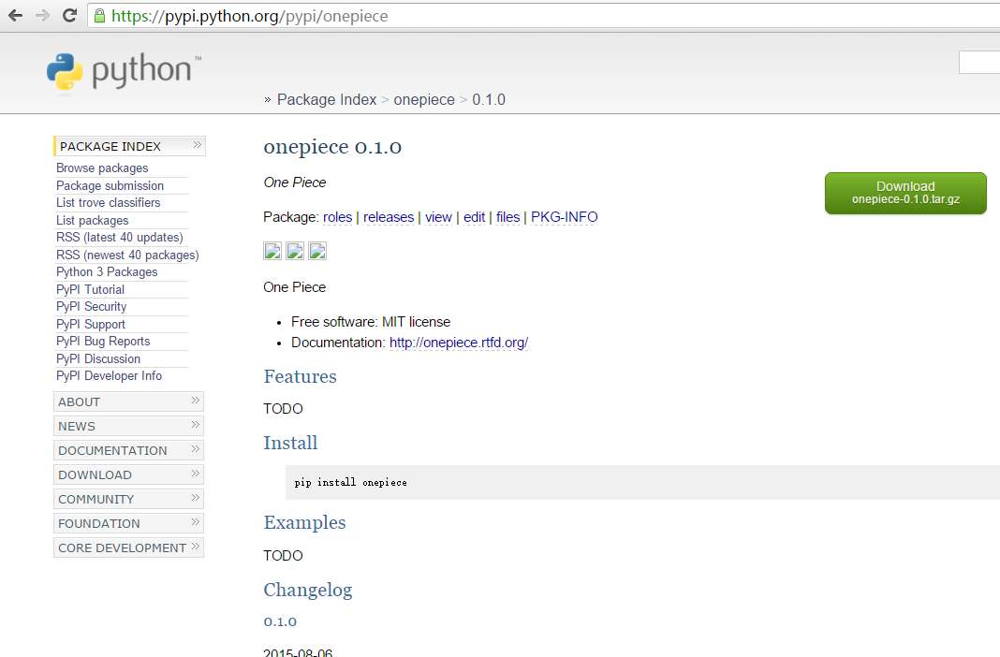

如何快速构建一个 Python 模块项目（开源方案）
============================================

这里只是用一个 Hello World 级别的模板类型项目，来说明下如何快速构建起来一个 \
Python 项目。且是在开源场景下发布，如果是闭源场景，再单独写一篇文章类似说明。

先看结果
--------

我们最终要完成的就是一个 Python 模块安装包。这里“完成”的定义是：实现功能、\
通过测试、发布到网上供别人使用。

比如：我们最后发布的是一个叫 onepiece 的 Python 库。

因为这里是允许开源的场景，所以就可以直接发布到 PyPI \
https://pypi.python.org/pypi 了，如图：

然后就可以直接用了，比如用 pip 方式安装：

::

   $ pip install onepiece

onepiece 库中演示模块的功能很简单，就是打印一个字符串“One Piece”就完事，如下：

::

   >>> from onepiece.example import hello_world
   >>> hello_world()
   >>> 'One Piece'

项目的源码直接查看 GitHub：https://github.com/akun/onepiece。

下面我们来看下，如何快速构建这么一个 Python 模块项目。

first commit
------------

直接用项目模板来初始化项目，后续再单独写一篇文章，详细解释由模板生成的模块项目\
中各个文件的作用。因为用了模板，这里所谓的“快速构建”模板的历史积累起到很大的作\
用，我们要遵循 DRY（Don't Repeat Yourself）这个原则。

安装模板工具
~~~~~~~~~~~~

你得先安装一个模板工具，后续会用到，如下：

::

   $ pip install cookiecutter

或者如果你用的是 Ubuntu 的话，也可以:

::

   $ apt-get install python-cookiecutter

初始化项目
~~~~~~~~~~

然后，就可以用现成的 Python 项目模板初始化了，比如：

::

   $ cookiecutter https://github.com/akun/aproject.git  # 按提示输入内容即可
   $ cd onepiece
   $ virtualenv onepiece_venv
   $ source onepiece_venv/bin/activate
   $ make

初始化 Git 本地仓库
~~~~~~~~~~~~~~~~~~~

::

   $ git init
   $ git add .
   $ git commit  # 比如日志是：chore: init project

推送到 Git 远程仓库
~~~~~~~~~~~~~~~~~~~

我们直接用 GitHub，直接在上面新建个项目，就叫 onepiece，然后把 Git 本地仓库推\
送到 Git 远程仓库：

::

   $ git remote add origin https://github.com/akun/onepiece.git
   $ git push origin master

DONE
~~~~

然后从 GitHub 上查看第一次提交的结果吧：https://github.com/akun/onepiece

就这样 first commit 就包含了一个完整的初始项目了，然而还没“完成”。

做好配置管理工作
----------------

下列原则可以参考下：

* 用项目模板协助初始化常见的配置管理；
* 代码未动，CI/CD 先行：因为这里是允许开源的场景，我们选用 Travis-CI 这个服务；
* 优先考虑安装部署脚本：立马发布一个空壳项目；
* 尽可能多的记录软件开发中产生的常见行为，参考：:doc:`/vcs/understanding`\。

实现功能并测试
--------------

因为是个示例，所以这里实现的功能就很简单了，就是打印一个字符串，代码如下：

.. literalinclude:: ../../pm/onepiece/onepiece/example.py

同样，测试代码也很简单，代码如下：

.. literalinclude:: ../../pm/onepiece/tests/test_example.py

测试
----

独立一节来说，就是为了说明构建中测试是必须的环节，在这里，测试也很简单：

::

   $ make test

可以看到所有测试用例在 Python 2 和 Python 3 下都通过，测试覆盖率是 100%，如下：

.. literalinclude:: tox_result.log

这里演示的是一个很简单的单元测试，Python 的单元测试可以详见：\
:doc:`/unittest/python`\。

文档
----

独立一节来说，也是为了说明构建中文档是必须的环节，对于一个初始的项目，文档也很\
简单，大致包括：

* License：开源项目，一般会有个开源许可证书声明，这里选择的是相对自由的 \
  MIT License。关于各种开源证书的选择，可以参考文章：\
  https://choosealicense.com/，或懒得想太多就参考：\
  http://www.ruanyifeng.com/blog/2011/05/how_to_choose_free_software_licenses.html；
* README：说明项目是干什么的、如何安装、如何使用、如何开发、如何发布，前三者是\
  对于使用项目的人来说的，后两个一般是你的项目协作者需要关心的。如果内容很多，\
  就不要都放在 README 了，可以拆分为多个文档；
* Changelog：一开始也可以写在 README 中，当然后续维护的版本多了后，可以拆分为\
  独立的文件维护；
* Credits：可能有的人会写上贡献者的荣誉信息；
* 有的还会加上一堆有用的第三方服务的 **badges** 来体现你的项目是一个靠谱的项目\
  ，比如：这里 onepiece 示例项目中的 CI/CD 构建是否通过、代码健康程度，以及测\
  试覆盖率等等。

推荐用 Sphinx 写技术文档，尤其你写的是 Python 项目。当然，MarkDown 也很流行，\
很多人习惯用这个写文档。用 Sphinx 写技术文档，详见：:doc:`/doc/sphinx`\。

Ship it!
--------

到了最重要的一个环节了，发布 Python 模块库到 PyPI，直接：

::

   $ make sdist

想了解 make sdist 中具体命令，后续再写一篇如何发布到 PyPI，这里不展开说明。

为什么说发布很重要，原因很简单，你不发布，那前面那些对用户来说相当于没有发生。

现实是复杂的
------------

* 上述案例也就是个简化的项目，或者说是一个很小的类库级别的微型项目；
* 项目规模大，单一的项目模板必然不适用，比如：多语言的项目；
* 大项目必然会拆分成各个小项目，各个项目集成起来必然复杂；
* 所谓的一键发布脚本以及 CI/CD 脚本，需要持续维护，可能逻辑随着项目复杂度上升\
  ，也会越来越复杂，一般一个团队都会让 0.5 个人维护这些东西，如果项目规模略大\
  ，那么就来个完整的 1 个人甚至是 1 个团队来维护也不夸张。

总结
----

我们用到的工具或服务有这些：

* 配套工具：cookiecutter + tox + nose + coverage + Sphinx + EditorConfig + \
  prospector
* 配套服务：GitHub + Travis CI + Landscape + Coveralls + Read the Docs

配套工具和配套服务，前面提过，后续的文章中详细讲解模板里的文件时候再一并讲解，\
可以先简单看下这里：:doc:`/tao/opensource`\，对配套服务有简单介绍。

最后记住，大家一定要根据自己的需要形成自己的模板。

参考
----

* http://www.oschina.net/translate/open-sourcing-a-python-project-the-right-way
