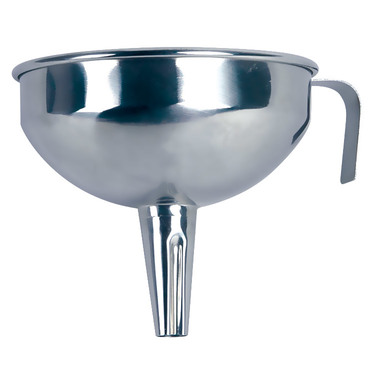
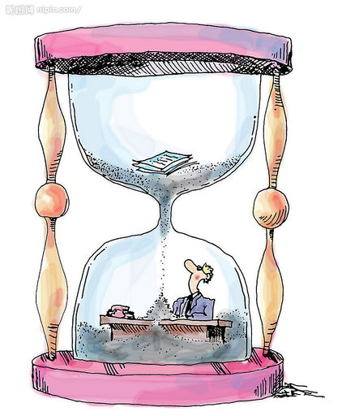
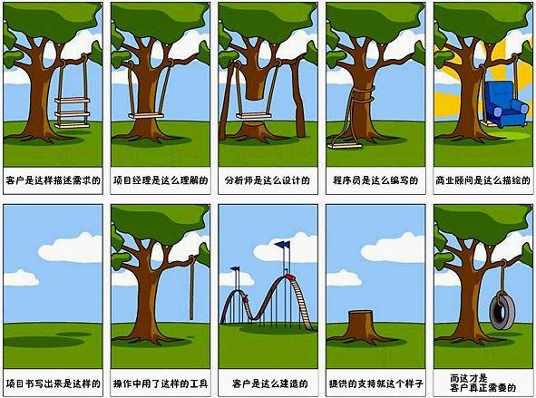
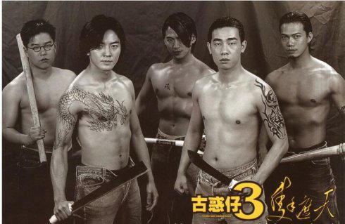
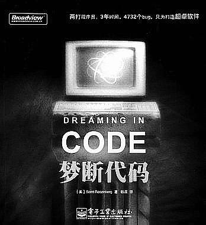

软件开发过程杂谈
================

这里特别说是“软件开发过程”，而没有特别用“软件工程”？

* 一是，软件工程涵盖的范围太大了，所以直接取其中的开发过程来重点说明，并且大家\
  更喜欢关注，软件工程中的具体开发过程。
* 二是，软件“工程”的所谓工程，和其它的工程实在有些差异，而更接近于是艺术品的创\
  作过程，比如：画、音乐等艺术形式的创作。

虽然有差异，但被冠上“工程”的名字也有道理，其本身也强调“如何做”（于工程师而言）\
，而有别于“为什么”和“是什么”（于科学家而言）。

下面就按常见的瀑布模型来说明下软件开发过程，说是瀑布模型，切忌把下列的各个阶段\
划分得层级很清楚，其实这些都是前后连贯的，有的过程甚至是贯穿全程的。

我想要一个东西？！
------------------

对用户（或者说客户）来说，软件开发就是这么简单：

**我有一个想法 -> 一个哆啦A梦（就是所谓神奇的工厂，最好再加上个时光机器） -> \
这就是我想要的**

但真正从事过软件开发的人知道，哪有这么简单。

“银弹”
~~~~~~

很多软件开发的说上都提到过什么“银弹”，那么有没有“银弹”呢？自然没有，这也是“软\
件工程”很难达到所谓“工程”的表现。我对此的理解是：事实上，开发软件根本没有所谓\
“绝对正确的方法”，倒是有很多错误的方法。

“务实”
~~~~~~

所以没有“银弹”咋办？最有效的方法，那就是说了没说一样的说法：“务实”，或者说具体\
问题具体分析，具体项目具体安排，具体团队具体战法。也就是说非常依赖于“人”，所以\
对于一个广义上的软件来说可能得包括：

* 平时我们所说的“软件”。
* 软件运行在的实际“硬件”。
* 能让上述两者实际结合的“湿件”，也就是你，“人”，或者说人的脑细胞或思维过程。

这里再提个问题，为什么软件有别于其它我们所见的物质，为什么没有质量（这里特指重\
量那种意思）？如果思考过这个问题，你就会觉得软件开发过程，的确更接近于画、音乐\
等艺术形式的创作：好比用画料涂在纸上，乐曲谱在纸上或其它介质上类似，软件也只不\
过是装在了硬件上。

需求分析
--------

这是是一个很重要的环节，同时也是一个很难的环节。

但貌似很多软件工程师或者说程序员，觉得这个环节很没有技术含量，但这的确也是一个\
必须要掌握的技术之一（如果说编程语言等计算机相关知识算是“硬技术”的话，那么这个\
需求分析环节你可以认为是“软技术”）。

另外，很多程序员往往会将“需求”和“解决方案”这两个概念混在一块，导致最后做出的软\
件南辕北辙或不尽如人意，看下两个例子吧：

例子一：

* 产品将易于使用，是需求。
* 产品将有一个图形用户界面，是解决方案。

例子二：

* 产品将在菜单条上有一个时钟，是解决方案。
* 产品将使用户意识到当前的时间，是需求。

为什么容易混呢？因为很多程序员直接把用户说的话当成是“需求”，而用户往往说出来的\
话只是他所要的“需求的解决方案”，只不过以他的知识范围内想出来的而已。而你应该要\
做的是挖掘其背后的真正需求，也就是上面说的，用户只是想让产品易于使用和想意识到\
时间而已。而作为程序员，你的作用就是将需求用你天才般的脑袋想出一个不错的解决方\
案，也许会比用户替你想的更好（也就是上面提到的“工程”强调“如何做”）。

最后，需求分析后：

* 切记需求 txt 化。一个意思就是，有记录，条目化；另一个意思就是，需求十有八九\
  是会有变更的，是很容易随时被编辑修改的。
* 最好需求 exe 化。一个意思就是，需求具备技术上的可执行性；另一个意思就是，理\
  想上最好需求能固定下来，当然如果做不到这点，那么有需求变更了，也得有个编译\
  成 exe 的过程，也就是需求变更要有变更流程，或者说要让大家都意识到变更会有一\
  定的代价。

再回到刚才出现的图，漏斗所要表达的意思是，需求分析最好能到达的效果就是，将一堆\
杂乱的信息，通过这个漏斗后降噪过滤，最后得到的信息是更加有序的。相反的效果就如\
下图：

底下那个人就是另一个悲催的程序员，看起来慢悠悠的沙漏好像在过滤这需求，但最后还\
是那些信息，让人一头雾水。

然后要记清楚上面那2个例子表达的“需求”和解决方案的区别，切记南辕北辙。\ **虽说\
条条大路通罗马，但建立罗马帝国往往就一条路！**

再看下一个很流行的软件开发笑话的图。这种笑话时刻发生在我们平时软件开发的过程\
中，应该要避免出现这种情况。

概要设计
--------

这个阶段可以认为是整个软件的顶层设计，有的人喜欢叫构架设计或架构设计，不管叫什\
么吧。完成这个设计后：

* 关注业务的人看着这个业务构架图，听着你的讲解能了解这个业务是干嘛的，业务间是\
  如何协作的；
* 关注技术的人看着另一个技术构架图，听着人你的解释了解这个系统是如何运作的。

这个阶段，一般也会确定技术选型，比如：用哪些编程语言、编程框架、类库、操作系统\
、数据库等等技术层面的组件。

如果是个已经有成熟参考经验的系统，可能可以搭建出一个大致的框架，后续基于这个框\
架就可以进行具体实现了。

另外，这个阶段很重要的一点就是要进行下原型验证，无论这个原型是很原始的白纸黑字\
；还是低保证的原型草图；亦或是高保证的原型图（比如：系统本身有 UI 的话），基于\
这个原型，你能给别人很好的讲解清楚，帮助别人更好理解最后做出来的东西，这样就可\
以尽早确认完毕这个东西是不是别人想要的。

详细设计
--------

很多时候和写代码一起了，一般来说会重点关照，核心模块、重要模块、难度高的模块，\
可能不同人有不同风格吧：

* 有些人会更加仔细推敲设计而不会急于写代码。
* 当然对有些人来说，写出一个模块的接口层和主线运行逻辑，更为实际。

设计/编码/调试/测试
-------------------

这块过程对很多人来说应该算是最熟悉的了，也是最喜欢的，但往往其实花的时间也是最\
少的一个环节。

一旦进入具体实现阶段时候，日常工作大部分时间都是集中在这几块了。这里特地还把设\
计提出来，作为其中一部分，就是想表达设计的重要性，对于程序员来说编码只是实现你\
的设计的一个工具而已，工具用得熟练不表示设计思路足够好。

有不少人喜欢有足够单元测试覆盖的编码过程，日常编码时候，能让代码跑一会儿，又让\
测试跑一会儿。这样能保证写的代码能有足够的保险，无论是增加新特性、改进功能、重\
构代码、修复缺陷的时候都能信心满满的让代码运行在正式上线的系统中。

如果没有看过这张图中的那本书，建议可以看下，全书其实就是讲了一个悲剧的软件开发\
故事。看完后对比下自己经历的项目，就能发现各种雷同的现象，让自己以后避免这种经\
历。

新手

老手

上面 2 张图就是表达了新手和老手具体干活时候的状态，谁都是从新手过来的，所以新\
手的痛苦应该都有所体会，但只要把自己的基础牢牢打扎实了，就逐渐能变成老手一样会\
得心应手，随时运用手头的各种工具、技能、必杀解决各种问题。

效率！很重要的一个词。

有人说过，“很多效率低下的程序员，可以归结为基本功不牢。”，所以无论是新手阶段还\
是已经成为老手了，基本功必须扎实。

一个程序员得有构建能力，而且是足够好的构建能力，比如：从写下第一行代码，到编写\
功能代码、编写测试代码、编写技术文档、编写构建脚本、发布软件包，这些都能一气呵\
成。

* 0 -> 1。软件是个虚无的东西，相当于是程序员脑中得到设计，能转化成别人能看得见\
  用得了的软件。即：思考 -> 软件。
* 自动化。能做到所谓一气呵成，如果没有足够高的自动化是很难的。

如果你是个高效的程序员，那么你的价值一定要得到体现。即：\
**show me the code, show me the money!**

当然写出好的代码到成为一个好的软件或好的产品还是有一段距离的，可能不一定是技术\
层面的事情了，但技术是必备的一部分。如果足够幸运，你的软件产品能做到苹果产品那\
么成功，就可以让别人，\ **show me your kidney， show you the apple**

最后，大家要注意保养啊！可以得花买本《程序员健康指南》看看吧。

test and test
-------------

再说下测试，其实前面已经涉及到测试了，编写代码边测试，那个测试算是细粒度的测试\
，或者我们平时说的单元测试。这里说的测试粒度更大。

集成测试
~~~~~~~~

很多人觉得做集成测试这么痛苦，代码集成、模块集成、项目集成，十分让人头大，然后\
暴露各种问题，怎么解决？

解决办法很简单：更频繁地集成，从而减少潜在的冲突，让问题提前跑路出来。也就是说\
把你觉得困难的事情提前，到后面来看这都不是事了。这里看起来有点心理效应上的味道\
，但其实也有很多技术操作方面的方式来降低集成的难度。

痛苦的集成测试

幸福的集成测试

系统测试
~~~~~~~~

这里重点说下测试的目的是啥？反正不是为了发现 bug 而测试，引用我觉得合理的话：

“简言之，测试的目的应该是验证需求，bug（预期结果与实际结果之间的差别）是这个过\
程中的产品而非目标。测试人员应该象工兵一样，在大部队（客户）预期前进的方向上探\
雷、扫雷（bug），而不需要去关心那些根本没有人会去碰的地雷。”

发布/交付
---------

这就是我想要的东西！
~~~~~~~~~~~~~~~~~~~~

到达这里，算是一个里程碑，但一般来说不是终点。

交付、验收完毕，往往进入下个迭代周期，进行日常维护、系统升级等等，又不断重复着\
上述过程。直到这个软件不在维护，逐渐消亡、报废处理。

坑爹！这哪是我想要的东西啊？！
~~~~~~~~~~~~~~~~~~~~~~~~~~~~~~

这个是我们要避免的情况，运气好，回头重走一遍上述过程，顶多就亏本付出些额外代价\
；运气不好，直接跟你说再见了！

想象的和现实的差距
~~~~~~~~~~~~~~~~~~

为了避免出现这种情况，一定要记得时刻问一句：这是客户/用户想要的吗？

完结
----

银弹是否存在？存在吗？不存在吗？如果真有的话，那一定是一个靠谱的团队！

这里有个个人觉得不错的检查条目（这个翻译可能是台湾版本的翻译）

《Joel 衡量法则》

* 你们用不用源文件管理系统？
* 你们可以把整个系统从源码到ＣＤ映像文件一步建成吗？
* 你们每天白天都把从系统源码到ＣＤ映像做一遍吗？
* 你们有软件虫管理系统吗？
* 你们在写新程序之前总是把现有程序里已知的虫解决吗？
* 你们的产品开发日程安排是否反映最新的开发进展情况？
* 你们有没有软件开发的详细说明书？
* 你们的程序员是否工作在安静的环境里？
* 你们是否使用现有市场上能买到的最好的工具？
* 你们有没有专职的软件测试人员？
* 你们招人面试时是否让写一段程序？
* 你们是否随便抓一些人来试用你们的软件？

后续主题会逐渐展开说下几种常见的软件开发流，当然还是那句话：“具体问题具体分析\
。。”

参考
----

* `工程学 <http://zh.wikipedia.org/zh-cn/工程学>`_
* `没有银弹 <http://zh.wikipedia.org/zh-cn/没有银弹>`_
* http://baike.baidu.com/view/19375.htm
* http://chinese.joelonsoftware.com/Articles/TheJoelTest.html
* 《项目管理修炼之道》
* 《软件项目成功之道》
* 《掌握需求过程》
* 图片资源来自网上
