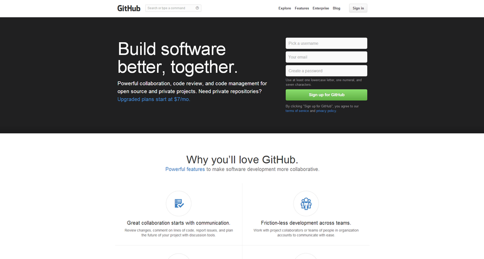
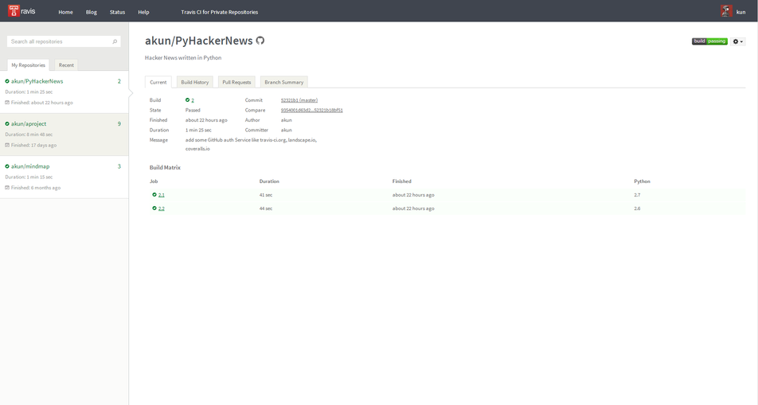
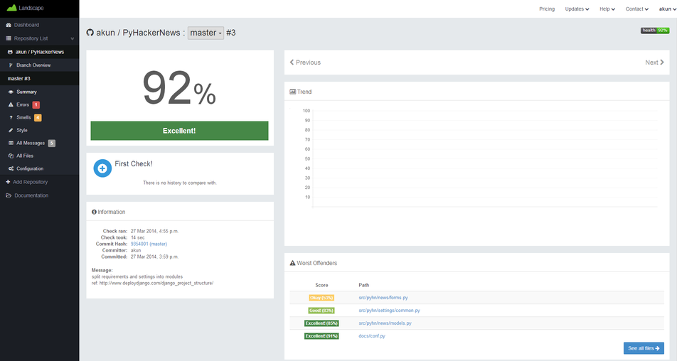
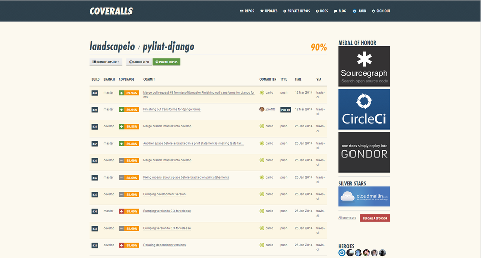
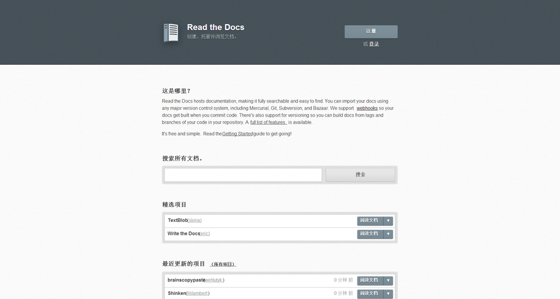

做开源软件项目会用到的服务简介
==============================

一般，程序员做公司的商业软件项目都会用到各种工具，这里的工具是指，源代码的版本控制、持续集成等工具。但世界上很大一部分软件项目其实都是开源的（没有统计过，猜想而已），而开源软件项目，参与的程序员一般都分散在世界各地，没有集中的工作场所，自然也不会有统一的涉及软件配置管理等工具的托管场所。

那么，有没有好的解决方案呢，自然是有。即使没有的话，也会有一帮程序员做出类似的工具和服务的。比如，下面会介绍的几个部分服务，完全可以满足大多数开源项目的要求（Python项目就更多满足了）。这些服务都是免费的，当然要更好服务，那就得掏出一些美刀了。

当然，如果信任这些服务的话，很多公司的商业项目或初创公司而言，也完全可以用这些服务起步，只要支付一定的美刀就行，就能省去很多额外的麻烦。

**注意：部分服务的网站可能需要翻墙。**

源码托管
--------

GitHub：https://github.com/

就不废话了。如果不想折腾成Mantis、Bugzilla、Trac、Redmine那种更为复杂的issues跟踪管理，也完全可以用来做开源项目的issues跟踪管理。

持续集成
--------

Travis CI：https://travis-ci.org/

很好结合到了GitHub，可以用GitHub帐号统一注册登录。

只要开源项目中，写好相关配置，就会自动按配置执行持续集成的相关过程，比如：单元测试，真正做到让你的每一次代码提交，都能得到测试。当然，前提是你得写单元测试代码啦。

有关单元测试的内容，具体可以看 :doc:`/unittest/index`

代码质量检查
------------

Landscape：https://landscape.io/

也是很好结合到了GitHub，可以用GitHub帐号统一注册登录。

只要开源项目中，写好相关配置，就会自动按配置执行代码质量检查，看看代码有没有错误啦，有没有“坏味道”啦，以及有没有违反约定风格之类的东西。

不过，这个服务只针对Python作为编程语言的项目，其它编程语言估计也有类似的服务吧（没有的话，估计也有一帮程序员正做着吧）。

测试覆盖率检查
--------------

Coveralls：https://coveralls.io/

同样，很好结合到了GitHub，可以用GitHub帐号统一注册登录。

只要开源项目中，写好相关配置，就会自动按配置，根据持续集成中单元测试结果，得到测试覆盖率。

文档托管
--------

Read the Docs：https://readthedocs.org/

也是可以GitHub帐号统一注册登录。

项目的文档只是得用Sphinx编写（对Python项目而言，Sphinx这个算是标配工具了），就可以很好的用这个服务了。

有关Sphinx的编写，具体可以看 :doc:`/doc/sphinx`

最后
----

具体如何使用，这里就不介绍了，各个服务的网站上都有足够的文档说明。并且，这只是一片水文而已，所以不会有太多内容的。

上面几个服务，大多都提供徽章了服务，比如，可以直接放到GitHub项目中的README中，这样别人就可以看到你的项目持续集成是否通过、代码质量是否足够好、测试覆盖率是否足够高。例如，这个我正在写的一个简单的类似Hacker News网站的开源项目：https://github.com/akun/PyHackerNews

README中再放上一个项目文档的链接，就给自己的项目配备了很好的文档服务了（特别是很多类库性质的项目）。比如，这个《软件构件实践》系列文章就是用了这个文档托管服务：http://pm.readthedocs.org/
