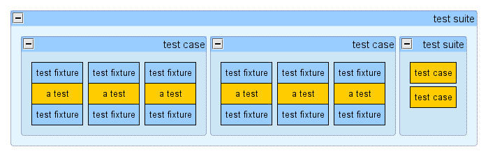
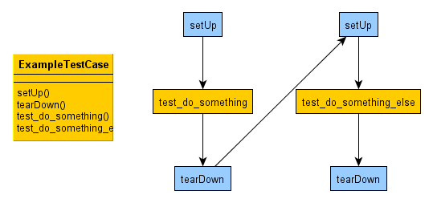

Python中的单元测试
==================

^
--

上篇文章《:doc:`hello`\》闲扯了下个人对单元测试的看法。

后续几篇 :doc:`index` 主题的文章，打算先选几个常见的编程语言作为示例来讲解，因为最近个人的主要编程语言是Python，那就必须先以Python为例讲解最省事了;-)

举个“栗子”
----------

偷懒，就直接拿Python官方文档中的例子来做说明好了;-)

.. literalinclude:: test_random.py

先简单说下代码的意思，也就是：写1个测试用例（TestCase），用来测试Python自带的random模块，那1个测试用例里面包含了3个测试，分别用来测试random模块的3个函数（看Python源代码，其实在random模块中已经把一个Random类实例化了，所以从外部用法上看起来就是函数调用一样）。

再简单解释下代码中出现的几个概念，后续再详细讲解：

* TestCase，就是测试用例，一个测试用例可以包含多个测试（为了避免混淆可以把“测试”叫“测试项”）。代码中以Python类的形式出现。
* test_xxxx，就是测试项，根据实际的功能代码逻辑来编写对应的测试项。代码中以Python类方法的形式出现。
* assertXXXX，就是检查点，相当于平时执行测试中的，判断测试结果是否符合测试预期结果的代码模拟。
* setUp，就是执行测试项前的准备工作，比如：可以做一些初始化工作，这里就是初始化一个Python列表。另外，和setUp对应的还有个tearDown，后面会讲到。作为一对兄弟，相当于是平时执行测试中的2种行为的代码模拟，分别是：准备测试执行所需要的环境，以及销毁测试过程中产生的垃圾。

几个概念
--------

其实这里讲解的就是Python标准库，unittest模块，又叫PyUnit。类似其它编程语言，也都有对应的所谓XUnit，X可以替换为Java等其它编程语言等。

这里只是简单讲解下unittest模块中的几个概念，当然其他XUnit也会有类似概念。

test fixture
~~~~~~~~~~~~

貌似平时习惯直接就叫fixture了，如果非得翻译个中文名称，叫“装置”不知道合不合适，也就是测试需要的装备。理解上可以直接对应到上面提到过的setUp和tearDown。所谓fixture就是：比如，程序运行的前提需要数据库，还得准备测试用的数据，常见的那些对数据库的操作程序就会如此；又比如，程序运行的前提得访问某个网页，常见的那些爬虫程序就会如此。类似这些，得需要准备好这些fixtures，而这个装置能有所谓清理和还原的功效（tearDown），这样不至于各个测试执行的时候有环境污染造成各种诡异情况。

test case
~~~~~~~~~

这个最直白，也听的最多，叫测试用例。理解上可以直接对应到上面提到过的TestCase这个类。对于测试用例来说，就是针对功能代码，模拟一些输入，来验证输出是否符合预期。

test suite
~~~~~~~~~~

测试套件，也好理解，就是包含了一堆test case的集合。使用上可以根据具体场景来归类各个test case吧，比如：根据业务逻辑分（模块A、模块B）；根据测试逻辑分（全功能测试、冒烟测试）。当然，测试套件也可以包含一堆其它测试套件。

test runner
~~~~~~~~~~~

跑测试的家伙，你把各个测试丢给他，他去执行，然后把测试结果形成一份报告让你看。

关系
~~~~

画个示例图，应该可以更好理解这除了test runner外的几个概念的关系吧：

程序执行
--------

上面这个图，就是一个TestCase执行测试代码的时候，程序执行的过程吧，想要了解更直接些，直接运行下面这个程序，看下输出信息应该就明白了。

.. literalinclude:: test_order.py

控制台输入如下：

::

   test_do_something (__main__.ExampleOrderTestCase) ...
   I am setUp
   I am test_do_something
   I am tearDown
   ok
   test_do_something_else (__main__.ExampleOrderTestCase) ...
   I am setUp
   I am test_do_something_else
   I am tearDown
   ok

TestCase
--------

一般来说，日常用Python写单元测试代码，最多的还是跟TestCase打交道。而搭建针对具体项目的测试框架时候，会用到的较多是TestSuite、TestResult、TestLoader这些，一旦项目中的测试框架搭建成体系了，很少会打交道。所以，先单独讲下大众化点的TestCase。

setUp()
~~~~~~~

执行某条测试前需要准备的工作，比如：某个文件或目录必须存在、数据库需要初始化好、网络服务要准备好、访问的URL需要登录授权完毕等等。

每次调用测试前，都会执行这个方法。如果你运行过上面的程序就应该了解。

顺便讲一下2个概念：测试错误（Error）和测试失败（Failure）。

* 测试错误，可以简单理解成测试代码执行时候报错了，比如：测试代码中print a，而a没有进行变量声明。
* 测试失败，可以简单理解成测试代码执行正常，但没有得到预期的测试结果，比如：测试代码中调用功能代码add(1, 2)，但返回结果不是3。
* 另外，从Python 2.7开始支持了skip特性，也可以理解为测试忽略（Ignore），比如：某个测试只想在Windows下才运行，这样在Linux下就会被跳过，也就是忽略。

好了，现在可以讲了，如果代码在这个阶段出错，都会认为是测试错误（Error），比如：

.. literalinclude:: test_set_up_error.py

执行python test_set_up_error.py输出：

::

   EE
   ======================================================================
   ERROR: test_one (__main__.SetUpErrorTestCase)
   ----------------------------------------------------------------------
   Traceback (most recent call last):
     File "unittest/test_set_up_error.py", line 6, in setUp
       self.assertEqual(1, 2)
   AssertionError: 1 != 2

   ======================================================================
   ERROR: test_two (__main__.SetUpErrorTestCase)
   ----------------------------------------------------------------------
   Traceback (most recent call last):
     File "unittest/test_set_up_error.py", line 6, in setUp
       self.assertEqual(1, 2)
   AssertionError: 1 != 2

   ----------------------------------------------------------------------
   Ran 2 tests in 0.001s

   FAILED (errors=2)

结果是2个errors，可以将代码中的setUp的assert修改正确了，再次执行试下，会发现结果是2个failures

tearDown()
~~~~~~~~~~

执行某条测试完毕后需要销毁的工作，比如：删除测试生成的文件或目录、销毁测试用的数据库等等。

每次调用测试后，都会执行这个方法，即使调用的测试错误（Error）也会调用，比如：

.. literalinclude:: test_tear_down_always.py

执行python test_tear_down_always.py -v输出：

::

   test_one (__main__.TearDownAlwaysTestCase) ... ERROR

   I am tearDown
   test_two (__main__.TearDownAlwaysTestCase) ...
   I am tearDown
   ok

   ======================================================================
   ERROR: test_one (__main__.TearDownAlwaysTestCase)
   ----------------------------------------------------------------------
   Traceback (most recent call last):
     File "unittest/test_tear_down_always.py", line 11, in test_one
       print not_defined
   NameError: global name 'not_defined' is not defined

   ----------------------------------------------------------------------
   Ran 2 tests in 0.006s

   FAILED (errors=1)

这样设计也是为了不让某个测试的错误，影响到下个要执行的测试，所以必须要执行到清理。

**如果setUp就测试错误（Error）了，那tearDown()会不会执行呢？各位可以自己写代码验证下;-)**

.. .. literalinclude:: example.py

另外，跟setUp类似，如果代码在这个阶段出错，也都会认为是测试错误（Error）。

assertXXXX()
~~~~~~~~~~~~

XXXX代码Equal、NotEqual等等一堆协助单元测试的判断方法，太多了直接看官方文档最直接了。问题是这么多不经常用难免记不住，所以平时基本上就记了：

* assertEqual
* assertNotEqual
* assertTrue
* assertFalse
* assertRaises

因为大多数都可以根据这些转化出来，当然，如果记住最好了，可以帮你一定程度上简化代码，以及增加代码的可读性。比如：要明确判别一个正则输出是否符合预期，用assertRegexpMatches，一看就知道是验证正则表达式的，就比单纯的assertEqual或assertTrue的可读性强。

当然，根据自己项目中实际情况，完全可以基于上述组合，封装出更具项目中的语义表达，提高下代码的可读性，比如：下几篇文章会讲到的Django中的单元测试框架，就封装了不少适合Web开发中的assertXXXX，比如：判断是否URL跳转等。

另外，需要说明的是几个failXXXX的判断方法、assertEquals、assert\_，已经不推荐使用了。

搭建自己项目中的单元测试框架
----------------------------

这篇文章就先引出这个主题，暂时不详细展开，后续几篇文章逐渐来展开。

下面几个也会用到，但对于一个项目，已经搭建起来了比较完善的测试框架后，这些就不会经常用到或去改动了。组合使用下面几个，就可以根据各自项目中的实际情况，来搭建一个基本的单元测试框架，后来者基于这个框架，按照约定来填充单元测试代码就可以了。

TestSuite
~~~~~~~~~

上面也提到了，TestSuite可以认为是一堆TestCase根据需要打个包，实际运行测试还是以TestCase为单位的。看官方文档，可以知道TestSuite有两个常用的方法，addTest和addTests，addTests可以认为是循环调用了多次addTest。这里add的Test可以是TestCase，也可以是TestSuite，反正是一个套一个，大鱼吃小鱼的关系。

几个实例，可以修改需要执行的不同suite自己执行下试试：

.. literalinclude:: example_test_suite.py

TestLoader
~~~~~~~~~~

可以看到上面最后一个例子，有用到TestLoader这个类，现在简单介绍下。根据刚才的例子，可以把TestLoader简单理解成辅助TestSuite的工具，用来收集符合要求的测试，或者可以认为是一个可以批量产生TestCase的工具。

看官方文档提供了很多方法，用于适应不同的场景，大多数都是类似loadTestsFromXXXX这种方法。

默认有个实例化完毕的可以直接拿来用，就是unittest.defaultTestLoader，上面示例代码中也有体现。如果你觉得默认不满足实际使用，那么就自己写个TestLoader也可以。

另外，还有TestResult和TextTestRunner这两个很有用的东西，可以在后续介绍Django中的单元测试中来重点说明，顺便也可以简单阅读下Django的单元测试框架代码，了解下还是有好处的。如果以后在项目中，需要自定义自己特殊需求的单元测试框架的时候还是有点参考意义的。

doctest
-------

这里简单提下，Python中还自带doctest这种形式的单元测试，就是直接把测试写在文档注释。其中一个优点是，看到注释就知道这个模块、函数、类是怎么个用法了；而其中一个缺点是，测试代码的组织上很难模块化。这里就看个简单示例吧：

.. literalinclude:: test_doctest.py

执行python test_doctest.py -v输出：

::

   Trying:
       print show_me_the_money()
   Expecting:
       $
   ok
   1 items had no tests:
       __main__
   1 items passed all tests:
      1 tests in __main__.show_me_the_money
   1 tests in 2 items.
   1 passed and 0 failed.
   Test passed.

$
--

如何来体会Python中的单元测试，直接在自己的项目中写段单元测试代码吧， **show me the code** 最实在了。所谓实践就得，Think -> Do -> Done -> Think

* Think：就是得有这个意识或者说想法吧，没有意识的话，一切无从谈起。
* Do：在自己参与的项目中，先开始尝试着写上一段单元测试代码吧。比如：修复缺陷的时候，增加新特性的时候等等。
* Done：成为一种习惯，最后就跟呼吸一样，如果停止，你会觉得难受。
* Think：继续Think，实践过后，每个人一定会有自己的感悟和理解。作为一个思考者、改良者、传道者，分享出来你的看法和经验吧。

后续
----

这里只是很简单地介绍了下Python中的单元测试，更详细的其实还是直接把官方手册相关部分完整的读一遍最实在了，当然希望这篇文章不是官方手册的重复就好。

这里讲的示例，估计实际项目中用起来，也就能应付个基本的加减乘除那种业务逻辑的场景。实际的项目，根据不同类型的开发项目，会有各种需要模拟的测试场景，这个时候一般需要借助更高级抽象的单元测试框架、模块，比如：

* 可能你自己的项目中已经积累了适合你项目的单元测试类库，这样就挺好。
* 还有各种成熟的各种开源开发库，比如：Python的Web开发框架Django，它里面就提供了适合Web开发场景的单元测试各种类库。
* 还有需要模拟各种情况的类库，比如：网络请求、数据库存储、读写文件等等，Python中就提供了不少好的模拟的库（可以Google下Python Mock，官方文档给出的这个资源链接也不错：http://pycheesecake.org/wiki/PythonTestingToolsTaxonomy）。

接下去打算再简单介绍下Django中的单元测试，算是Web开发类型的场景吧，当然还是Python，有兴趣的话，还可以看下Django源代码中有关单元测试的部分，相信会有更大的收获吧。如果有别的开发类型的场景，各位也可以分享出来，大家一起开开眼界。
