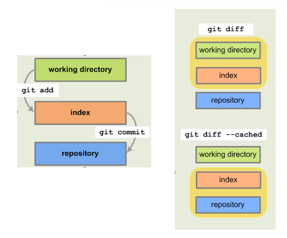

Git 常用命令用法：程序员的场景
==============================

Git 相比 Subversion，无论概念上还是使用上，复杂度其实是高出一个等级的。为什么\
这么说？分别看下 ``git help -a`` 和 ``svn help`` 命令清单的对比，单按这个来看\
，就如果要掌握所有命令的用法，Git 的学习曲线绝对是比 Subversion 高的。尽管如此\
，但还是有越来越多项目开始用 Git 来做源码管理了。

实际中，我们用到的的 Git 命令还是很有限的，可能也就 ``git help`` 中那些而已。\
下面就类似\ :doc:`../svn/usage`\ 一样，结合实际场景说下 Git 的常用命令用法。

“新人报道”
----------

你刚入职一家公司，或新加入某个团队，立马参与到一个项目中，那么就得获取项目代码\
，开始你的项目生涯。这个时候一般你需要克隆一份项目代码，下面都以 GitHub 上的项\
目地址为例：

::

   $ git clone git@github.com:akun/pm.git

之后就进入项目目录，运行项目中的构建脚本，然后就可以熟悉代码，展开具体工作了。

当然，有的时候，有一个新项目是由你发起的，你要将初始化的项目工程放到 Git 版本\
仓库中：

::

   $ mkdir pm
   $ cd pm
   $ git init
   $ touch README.md
   $ git add README.md
   $ git commit

Git 是分布式的版本控制系统，所以刚才的操作，算是已经在你本地版本控制起来了，为\
了推送本地仓库到远程仓库，就还得执行：

::

   $ git remote add origin git@github.com:akun/pm.git
   $ git push -u origin master

一般这个时候都会设置下 ``~/.gitconfig`` 或 ``.git/config`` 中的配置，最基本的\
就是用户名和邮箱

确认当前的 Git 配置信息：

::

   $ git config --list

设置用户名和邮箱：

::

   $ git config user.name akun
   $ git config user.email admin@example.com

刚才的命令只是对 ``.git/config`` 生效，如果想全局生效，也就是 ``~/.gitconfig``\
，就得加上 ``--global`` 参数，比如：

::

   $ git config --global user.name akun
   $ git config --global user.email admin@example.com

日常工作
--------

当你已经逐渐融入了一个项目，可能一天的工作场景或完成某个任务的工作周期是这样的\
：

更新
~~~~

无论是清早或下午或晚上，开始了你的一天工作，你首先会更新你的工作目录：

::

   $ cd ~/projects/pm
   $ git checkout develop  # 我想在 develop 分支上开始一天的工作

更新方式一：

::

   $ git fetch --all  # 从远程仓库获取所有分支的代码变更
   $ git merge

更新方式二：

::

   $ git fetch --all
   $ git rebase  # 默认就衍合 develop 分支的代码了

更新方式三，可以认为是 fetch 和 merge 的合集：

::

   $ git pull  # 懒得理解 fetch 和 merge 就直接 pull 吧

这样你就可以在最新的项目代码基础上工作了。

.. note::
   * ``git pull --rebase`` 相当于是前面的方式二的合集
   * 有关 "fetch + merge" VS "fetch + rebase" VS pull 的差异后续单独写一篇文章\
     说明
   * 这里说的三种方式，可能每个人或团队都有自己的习惯吧
   * 想了解 Git 中的“衍合”，可以实践下这个文档：\
     `Git-分支-分支的衍合 <http://git-scm.com/book/zh/Git-分支-分支的衍合>`_

修改
~~~~

可能你写了一个新的模块，需要纳入项目的版本控制：

::

   $ git add tools.py

可能你发现某个模块已经陈旧了，不再使用了：

::

   $ git rm utils.py

可能你发现一个模块的命名不太合理，需要改名：

::

   $ git mv model.py models.py

可能你要创建一个新的较大的模块，需要归档为目录的方式：

::

   $ mkdir groups
   $ touch groups/__init__.py
   $ git add groups/__init__.py

.. note::
   Git 不支持空文件加加入版本控制，非得必要咋办，后续的其它场景会简单说明下

可能你发现要写的模块代码布局类似于旧的模块，直接复制个代码模版：

::

   $ cp users/tests.py groups/tests.py
   $ git add groups/tests.py

.. note::
   Git 没有自带的所谓 cp 命令

当然，其实最常见的情况其实还是打开编辑器，比如 Vim，修改已经存在的代码，这个就\
跟 Git 命令无关了。

检查
~~~~

忙碌的一天过去了，或者一个任务完成了，这个时候一般会将你的工作成果，也就是代码\
更新到版本仓库（分为本地版本仓库和远程版本仓库）。

习惯上会先检查下修改状态：

::

   $ git status

看到一些 Git 状态信息，确认是修改了哪些文件，之后一般会自己 code review 一下代\
码的改动，可能有的人会习惯直接用 Git 方式来查看：

::

   $ git diff

这里的 diff 只是查看其中“工作目录”和“暂存区域”的区别\
。要查看“暂存区域”和“本地仓库”的区别，可以用：

::

   $ git diff --staged  # 或 git diff --cached

.. note::
   最好理解下三个区的概念，以代码角度来理解：

   * 工作目录：git clone 后获得的一份本地的代码，也包括新编辑的，尚未加入版本\
     控制的代码
   * 暂存区域：git add 后暂存起来，尚未 git commit 的代码
   * 本地仓库：git commit 后正式被版本控制记录起来的代码

   可以看下图，能更好的理解这三个区

然后本地运行下相关的单元测试，确认是否有问题。一般来说这个时候，没有什么特殊情\
况，就直接进入“提交”甚至是“推送”阶段了，然后结束一个工作日或工作周期，但难免会\
有些特殊情况出现。

取消修改
~~~~~~~~

当你 code review 完后，发现有些改动不满意；或者运行完单元测试，发现有些测试用\
例没通过，你可能会进行取消这些修改的操作。

如果还没 add，那么可以：

::

   $ git checkout -- main.py

为了避免刚好跟分支名重合，所以加了两个斜杠（虽然概率很低），如果已经 add 了，\
但还没 commit，那么可以：

::

   $ git reset HEAD main.py

万一刚提交完毕，也就是已经 commit 了，才发现代码有问题，比如：忘记把某个文件提\
交了，这个时候咋办？Git 好处是可以覆盖上一次提交，那么可以：

::

   $ git add tests.py
   $ git commit --amend

上面还只是简单的撤销操作，Git 还能支持更高级的重写历史功能，想掌握高级技能的可\
以实践下这个文档：\
`Git-工具-重写历史 <http://git-scm.com/book/zh/Git-工具-重写历史>`_

解决冲突
~~~~~~~~

有时候同别人合作写一个模块的代码，会把对方代码合并或衍合过来，比如：对方修复了\
某个缺陷，你刚好也需要这个修复；再比如：对方完成了某个特性，你也刚好需要用下这
个特性等等各种情况。

大多数情况，代码的合并或衍合不会冲突，但也有冲突的情况，分两种情况说明，第一种\
是合并操作时候有冲突：

::

   $ git fetch --all
   $ git merge bugfix/remove_error
   # 这个时候就提示你代码冲突了，处理完冲突的代码后
   $ git diff  # code review 下代码
   $ git add remove.py
   $ git commit
   # 日志中就多了一条合并操作的日志了

另一种是衍合操作时有冲突：

::

   $ git fetch --all
   $ git rebase bugfix/remove_error
   # 这个时候就提示你代码冲突了，处理完冲突的代码后
   $ git diff  # code review 下代码
   $ git rebase --continue  # 有时候会 git rebase --skip
   # 直到不用再 rebase 为止

提交到本地版本仓库
~~~~~~~~~~~~~~~~~~

最后，一切确认没问题了：code review 完毕，自己觉得代码满意了；有可能也合并完别\
人的修改并且没有冲突了；运行单元测试也通过了。那么就提交代码吧：

::

   $ git commit

推送到远程版本仓库
~~~~~~~~~~~~~~~~~~

Git 中的 commit 只是提交到自己本地的版本控制仓库，如果想分享你的代码提交，还需\
要推送到远程的版本控制仓库：

::

   $ git push

在分支工作
----------

Git 分支很灵活，用 Git 的合作开发模式方式也很灵活，如何更好得使用 Git 分支来合\
作开发，可以参考这篇文章：

* 中文翻译版本一：\
  http://www.juvenxu.com/2010/11/28/a-successful-git-branching-model/
* 中文翻译版本二：\
  http://www.oschina.net/translate/a-successful-git-branching-model
* 英文原文：\
  http://nvie.com/posts/a-successful-git-branching-model/

可能后续也会写一篇专门的以 Git 为例的源代码的管理和发布相关主题的文章。

下面说下在分支工作的常见的实际场景，按顺序：

创建新的本地分支
~~~~~~~~~~~~~~~~

确定要新开个分支来写代码，这里以贡献新特性为例子：

::

   $ git checkout -b features/batch_remove
   $ git branch -a  # 确认已经在新分支中工作了
   $ git log  # 可以确认是基于刚才的分支新分出来的

这里已经隐含了自动切换到新分支的动作了。

在新的本地分支工作
~~~~~~~~~~~~~~~~~~

类似，“日常工作”中的工作周期操作，这个时候，你就可以在新分支中进行大刀阔斧的工\
作了，直到分支中代码符合要求。

推送成为作为远程分支
~~~~~~~~~~~~~~~~~~~~

如果想把分支分享给别人，可以推送到远程版本库，这样别人可以根据需要来把你的分支\
代码更新到他自己的本地仓库，例如：

::

   $ git push origin features/batch_remove

合并或衍合远程分支
~~~~~~~~~~~~~~~~~~

在分支中工作一段时间后，确认相关的功能代码、测试代码、文档等都提交完毕了，单元\
测试通过，大家 code review 一致认为没问题，审核通过，最后该分支的持续集成（CI\
）完整 build 通过。这个时候，就可以进行合并的操作了。

其实前面也提过类似操作，这里再类似重复一遍，如果用合并：

::

   $ git fetch --all
   $ git merge features/batch_remove
   # 如果没提示冲突，那就合并成功
   # 如果这个时候就提示你代码冲突了，处理完冲突的代码后
   $ git diff  # code review 下代码
   $ git add batch.py
   $ git commit
   # 日志中就多了一条合并操作的日志了

如果用衍合：

::

   $ git fetch --all
   $ git rebase features/batch_remove
   # 如果没提示冲突，那就衍合成功
   # 如果这个时候就提示你代码冲突了，处理完冲突的代码后
   $ git diff  # code review 下代码
   $ git rebase --continue  # 有时候会 git rebase --skip
   # 直到不用再 rebase 为止

这里也提下直接合并本地分支，有时候你创建的分支只是自己用用，没有共享给别人，因\
为本地已经有了这份分支代码了，那么就省去 ``git fetch`` 操作，类似上述方式合并\
或衍合代码就行。

对比 Subversion 的分支合并操作，实在是简化不少。

删除分支
~~~~~~~~

如果确认工作完毕的分支不再需要了，那就记得及时清理掉，删除远程分支：

::

   $ git push origin :features/batch_remove

删除本地分支：

::

   $ git branch -d features/batch_remove

顺便说下，一段时间后，一定有一堆别人的分支，然后你 ``git fetch`` 下来了，这样\
就出现在本地的分支清单中，但远程版本库中已经删除了，如果想本地分支清单干净些，\
可以在 ``git fetch`` 时候这样执行：

::

   $ git fetch --all -p

Ship it
-------

可能在平时的研发分支工作一段时间后，并且测试完毕，大家觉得符合发布条件了。终于\
可以进入到版本发布阶段的工作了。

创建发布分支
~~~~~~~~~~~~

一般来说这个时候已经将在某个发布分支上工作了，比如：

::

   $ git checkout -b release-1.2 develop  # develop 就是平时的研发分支
   $ release.sh 1.2  # 比如有个执行发布脚本
   $ git commit

打标签
~~~~~~

确定可以发布了，就开始打标签吧，比如：

::

   $ git checkout master
   $ git merge --no-ff release-1.2
   $ git tag -a v1.2
   $ git tag  # 确认下打上了标签了
   $ git push origin v1.2  # 推送标签到远程版本库

正式发布
~~~~~~~~

发布又是一个比较复杂的主题，比如：能快速发布、快速回滚（包括数据回滚）、灰度发\
布等等，在\ :doc:`../../construction/index`\ 中会详细进行介绍，这里就简单罗列\
下。

一般来说，根据实际情况，可以记录下来发布相关的操作过程。很多环节可以写脚本将来\
的人工操作改成自动化操作。以后只要执行发布脚本执行一键发布就可以了。

其它场景
--------

可能还有很多别的场景，比较零散，但也算经常用到。

code review 查看代码，要知道对应代码是由谁写的，好询问了解具体代码的思路：

::

   $ git blame

跟踪问题时候，会查看日志，更方便历史代码定位：

::

   $ git log

觉得完整的 Git 命令太长，想用类似 Subversion 的缩写命令，可以用 alias，比如配\
置文件中可以写上：

::

   [alias]
       br = branch
       ci = commit
       co = checkout
       diffs = diff --staged
       st = status
       lg = log --graph --abbrev-commit --decorate --format=format:'%C(bold blue)%h%C(reset) - %C(bold cyan)%aD%C(reset) %C(bold green)(%ar)%C(reset)%C(bold yellow)%d%C(reset)%n''          %C(white)%s%C(reset) %C(dim white)- %an%C(reset)' --all

有时候合并或衍合代码，但本地有修改了一半的代码没有提交，可以先暂存起来：

::

   $ git stash
   # 合并或衍合完毕代码后
   $ git stash pop  # 恢复刚才修改了一半的代码

原来的一个项目想拆分多个项目，又想保留版本仓库记录，可以用下 git subtree split\
，例如：

::

   $ git subtree split --prefix=plugins/sqli

Git 不支持空文件夹加入版本控制，变通方式：

::

   $ mkdir downloads
   $ vim downloads/.gitignore  # 增加 * 和 !.gitignore 这两条规则

永远别忘了 help
---------------

对于习惯命令行下编程的程序员来说，多看帮助总是好的，直接执行

::

   $ git help

可以看到 Git 的常用命令，如果想看到更全的 Git 命令，可以执行

::

   $ git help -a

单独查看某个命令的帮助，可以执行

::

   $ git help add  # 比如 add 命令

会发现更多的命令，这个相比 Subversion 的命令更多，所以看起来也更复杂些，不过\
Git 本身也比 Subversion 更灵活、更好，比如：分支的使用、历史提交修改等。

好习惯
------

这里顺带说下几个使用 Git 的好习惯，但有的其实跟 Git 联系也不算大，只是顺带提下\
：

* 保持工作目录干净。或者说工作目录中的代码变更就为了完成一个任务，即一次只做一\
  件事。完成任务后，就直接 ``git commit`` 提交到本地版本仓库的某个分支中，而不\
  用担心其它任务作出的代码变更无提交。并且，对于分支切换更方便，而不用担心代码\
  被覆盖或冲突的问题。
* Git 的日志信息足够有效。足够有效的意思，是说这次提交作出的变更摘要，只要别人\
  阅读了日志就能知道大概，如果为了深入了解变更细节才会去查看具体代码变更。
* ``git commit`` 前 code review。code review 本身就是个好习惯，提交前确认是一\
  种更为严谨的方式，如果觉得自己 code review 发现不了什么问题，那么随便从身边\
  抓个会代码的，跟别人讲解下代码变更的内容，说不定会发现你没考虑到的问题。
* ``git commit`` 前跑单元测试。写单元测试本身也是个不错的习惯，如果项目本身已\
  经有了完备的单元测试覆盖了，那么你对代码的修改，应该能通过单元测试，所以提交\
  前执行一遍是否通过。如果没通过，就得看下是功能代码写的有问题，还是测试代码有\
  问题，比如：功能需求或接口设计有变化，而测试代码没有同步更新。
* 有代码变更及时提交。有 Git 这种版本控制工具，本身就是为了记录研发过程，避免\
  意外导致代码丢失，如果为了完成某个任务需要很长时间，代码也很久没有提交，风险\
  太高。这个时候，一般会自己开个分支，而将代码提交到分支中，既解决代码要及时提\
  交的问题，又解决代码提交频繁，可能造成代码不稳定影响别人的问题，因为那个分支\
  只有你自己在工作。而这一点，Git 分支的功能更为强大，更加鼓励多开分支。

最后
----

这些场景覆盖的 Git 命令其实很有限，如果要完整的熟悉，那就 git help 以及阅读下\
`《Git Pro》 <http://git-scm.com/book/zh>`_\ 这本官方推荐的入门书，有个系统的\
学习，基础才会更加牢固。

后续
----

另外，这里只是以程序员的场景来简单介绍 Git 使用，对于系统管理员，可能有一部分\
职责是作为 Git 版本仓库管理员，日常也会遇到的各种场景吧，后续也会简单介绍。

参考
----

* http://git-scm.com/book/zh
* http://source.android.com/source/developing.html
* http://www.oschina.net/translate/a-successful-git-branching-model
