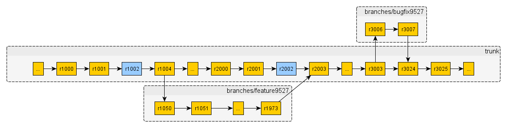

源代码的管理和发布：以SVN为例
=============================

前几天在微博吐槽了SVN的几个不爽的地方：.svn文件满天飞、分支管理的麻烦。不爽一般来说都是有过对比后才有如此感觉，比如：相比于Git；或者你对该事物了解不够，比如：.svn的问题，其实早在1.7版本中已经解决了。

至于分支管理，如果把控好，再加上项目本身代码质量足够高，其实也没那么麻烦。如果觉得麻烦，可能很大程度上，是项目的代码本身就很糟糕，造成管理上的麻烦，比如：要修改个特性，估计需要一段时间，为了不影响主干代码稳定，需要在分支中开发，到合并代码的时候就各种麻烦，但觉得麻烦其实很多时候是因为代码耦合度太高了。

下面有关SVN代码的管理和发布，其描述前提是团队成员往SVN贡献的代码，质量都是足够高的，并且前提是开发商业软件，会有钱、时间、质量这坑爹3角因素的影响，而不同于开源项目模式。

目录布局回顾
------------

先简单回顾下SVN的目录布局吧。

项目在版本仓库中的目录
~~~~~~~~~~~~~~~~~~~~~~

trunk、branches、tags，这是一个项目在版本仓库中典型的目录布局。

* trunk：主干，如果说把一个软件项目从开始到消亡比作一个故事的话，主线情节都在这里被SVN记录着。
* branches：分支，有很多种用法，比如：版本发布维护分支、新特性开发分支，甚至是缺陷修复分支等等。
* tags：标签，或者叫快照，某个版本发布时候，都在这里留档。

示例如下图：

不同版本仓库
~~~~~~~~~~~~

对于一个比较大的项目，可能会拆分为多个子项目，各个子项目团队，按照约定各自进行开发；或者一个公司有很多项目，每个项目团队都各自进行开发。无论哪种情况，这个时候版本仓库的建立有2种选择，公用和独立，其实对于使用SVN客户端的程序员来说没太大区别，唯一不同的是前者是公用一套SVN版本号，而后者是独立使用各自的SVN版本号的。而在这个问题上，SVN又不同于Git，Git的所谓版本号就可以认为全球都唯一，甚至全宇宙唯一？哪怕不同公司的版本仓库。

其实上面说的版本仓库的管理，理解上就可以认为是目录管理，再加上时间这个维度。下面以可能出现的三种情况作为例子，来说明SVN代码的管理和发布。

适合小团队情况
--------------

小团队，不同人的理解可能不同吧，这里就定量一下规模，索性特指2-4人水平都一样的小团队吧。在人员较少的情况下，如何来控制trunk、branches、tags这3者的关系？其实最简单的方式是大家都在trunk上贡献代码，觉得某个版本差不多了就tags一下，相当于和branches说拜拜了。

但这里其实会有几个问题：

* 要开发某个特性，会花费挺长时间，这段时间不提交代码不合适，提交了又会影响trunk代码稳定性，怎么办？
* 觉得差不多了是什么概念？能保证发布了某个版本测试没问题？保守点考虑，还是认为会有各种问题，需要严格测试，定量了，如果发现问题还得进行缺陷修复吧。
* 这个时候，另一个问题出现了，发布这个版本的那段时间，团队中的1-2个人完成本次版本的开发了，又想进行下个版本的开发工作，岂不是得停滞了，因为他们也不知道当前发布的版本有没有问题。

针对上述几个问题，可以尝试下下图的模式，但需要配合几个其它实践，保证迭代质量。

上图的意思，还是2-4人的小团队，集中战力在trunk进行新版本研发+旧版本维护，只不过区别就是，到了上面说的觉得差不多了，新的大版本或旧版本的某个小版本代码稳定的时候，分出去一个发布分支，由1-2个人严格配合测试，在该分支上工作，有需要修复的缺陷，有人在trunk上修复了，可以直接把该修复merge到发布分支上。

这里约定，新版本主要进行新特性的发布；旧版本进行旧特性的问题修复。但这里有个疑问，新特性的代码和旧特性的代码都在一起，那发布旧版本问题修复版本时候，新特性的代码咋办？这里就得用到其中1个实践，叫做“特性开关”，虽然新特性的代码已经提交到trunk，但发布旧版本的问题修复版本时候，该特性不会开放出来。对于用户来说，这个还是个旧版本的缺陷修复版本。

新特性的研发，必然伴随着代码的不稳定，代码质量的下降，这个时候就得用到另外2个实践，“trunk上每次代码提交进行codereview”和“每次代码提交的持续集成”，说白了就是每次代码提交都要有充分的反馈，如果团队的codereview习惯足够好，以及项目本身有了一套成熟的持续集成的话，就能一定程度上避免这个问题，如果发现有问题，立马反馈，及时修正。

还有最后一个疑问，都在trunk中，怎么保证新特性的代码和旧特性的代码管理起来足够分离？这个就得考验团队的设计能力时候了，是否能让各个功能模块间的耦合度足够低，从而把影响降低，说白了还得程序员足够厉害。当然这里说的“特性开关”不要太多，2-4人的小团队，2个大的特性开关已经很复杂了。如果这种开关很多咋办？这个时候其实不是你们团队从技术层面或管理层面需要解决的问题了，很有可能是当前的功能必须要更多人维护开发，就是需要扩充团队了；或者，根本不需要这么多功能特性，直接砍功能吧。

下面讲一个理想模型，比如项目资金流能撑得起更多的团队人员的情况下，如何更高效的研发。

比较流行的、推荐的
------------------

直接看图，跟上图很类似，区别就是，新特性研发trunk和旧特性维护branches分开来了，并且由2个小组分别负责：

* 红色外框代表小组1，一开始是新特性开发小组，该特性发布后，就变成旧特性维护小组了。
* 蓝色外框代表小组2，一开始可能是旧特性维护小组，另一个小组进行维护他们开发的特性的时候，这个小组角色就变成新特性开发小组了。
* 当然两组是实力相当的小组，他们来回切换新特性开发和旧特性维护。
* 并且能保障新版本研发和旧版本维护可以同时进行。

为了更好说明，直接引用一段SVN官方文档的故事描述

::

   http://svndoc.iusesvn.com/svnbook/1.4/svn.branchmerge.commonuses.html#svn.branchmerge.commonuses.patterns

   发布分支

   大多数软件存在这样一个生命周期：编码、测试、发布，然后重复。这样有两个问题，第一，开发者需要在质量保证小组测试假定稳定版本时继续开发新特性，新工作在软件测试时不可以中断，第二，小组必须一直支持老的发布版本和软件；如果一个bug在最新的代码中发现，它一定也存在已发布的版本中，客户希望立刻得到错误修正而不必等到新版本发布。

   这是版本控制可以做的帮助，典型的过程如下：

   * 开发者提交所有的新特性到主干。 每日的修改提交到/trunk：新特性，bug修正和其他。
   * 这个主干被拷贝到“发布”分支。 当小组认为软件已经做好发布的准备（如，版本1.0）然后/trunk会被拷贝到/branches/1.0。
   * 项目组继续并行工作，一个小组开始对分支进行严酷的测试，同时另一个小组在/trunk继续新的工作（如，准备2.0），如果一个bug在任何一个位置被发现，错误修正需要来回运送。然而这个过程有时候也会结束，例如分支已经为发布前的最终测试“停滞”了。
   * 分支已经作了标签并且发布，当测试结束，/branches/1.0作为引用快照已经拷贝到/tags/1.0.0，这个标签被打包发布给客户。
   * 分支多次维护。当继续在/trunk上为版本2.0工作，bug修正继续从/trunk运送到/branches/1.0，如果积累了足够的bug修正，管理部门决定发布1.0.1版本：拷贝/branches/1.0到/tags/1.0.1，标签被打包发布。

   整个过程随着软件的成熟不断重复：当2.0完成，一个新的2.0分支被创建，测试、打标签和最终发布，经过许多年，版本库结束了许多版本发布，进入了“维护”模式，许多标签代表了最终的发布版本。

你会发现其实很多开源项目就是这么干的，这种模式很通用，不仅限于使用SVN的情况下。

稳定的、干净的trunk
-------------------

再更进一步，如果项目规模很大，需要参与的人员较多，这个时候代码管理需要更为严格，需要对代码提交要求严格，保持trunk足够稳定、足够干净，可能就会有很多分支出现，比如常见的特性分支，甚至是修复一个缺陷，也会开一个缺陷分支，经过严格的codereview后再merge到trunk或某个维护分支，该实践会牺牲一定的灵活性，给团队成员带来繁琐的感觉，并且迭代起来会慢，建议谨慎使用，如果要用，得有足够理由。示意图如下：

习惯上，如果项目很大，一般都会拆分为多个子项目，各个子项目的各个团队都分别按小团队作战，来避免上述情况，从而提高迭代速度。

或者从工具使用上，可能这个时候使用的是Git，就能更好的解决类似问题，这个在以后的文章中有机会单独说下。

参考
----

* http://svndoc.iusesvn.com/svnbook/1.4/
* http://subversion.apache.org/docs/release-notes/1.7.html

结束
----

来个箴言作为结束吧：

童子军规则，“要让离开时的营地比进入时更加干净”

类比到写代码，“让模块签入（check in）的时候比签出（check out）的时候更整洁”

再装X些，“做人也是，你离开世界的时候能让世界变得更美好，哪怕一点也行！”
